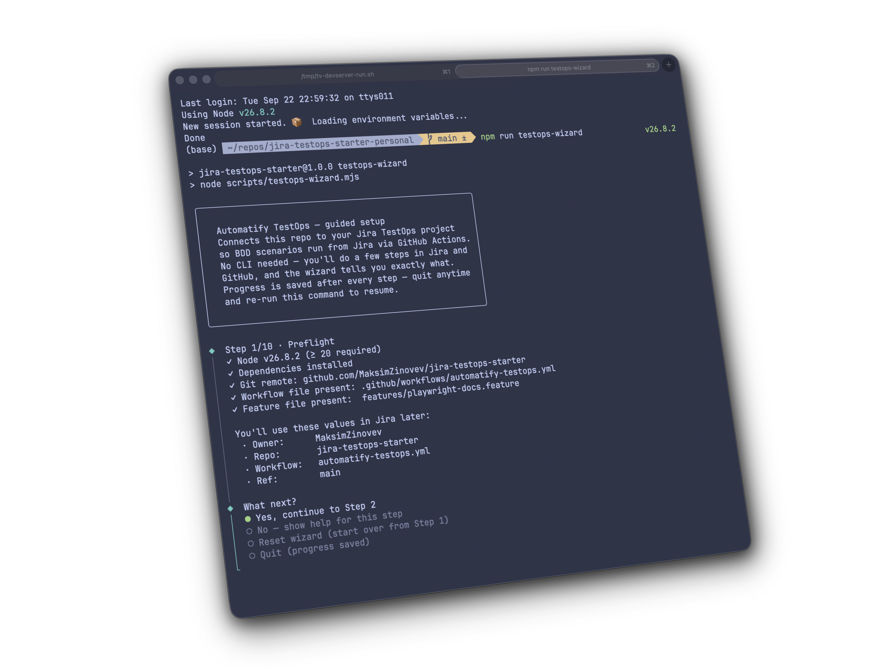
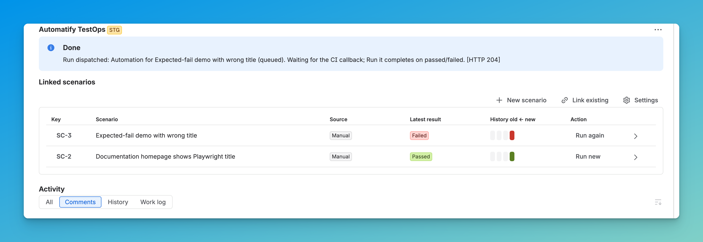

# Jira Testops Starter

> From installation to automated BDD tests triggered from Jira and results displayed right there - in under 10 mins.  

[What's inside](#whats-inside) • [Quickstart](#quickstart-guided-wizard) • [Agent](#prefer-an-agent) • [Local run](#run-the-sample-tests-locally-no-jira-needed) • [How runs work](#how-testops-runs-work) • [Troubleshooting](#troubleshooting)  

Docs: <https://automatify.com.au/docs/testops>



## What's inside

[Playwright](https://playwright.dev) + [playwright-bdd](https://github.com/vitalets/playwright-bdd) starter wired for **Automatify Jira TestOps**: two sample BDD scenarios, a TestOps-ready GitHub Actions workflow, a guided setup wizard, and an agent skill. Run your BDD scenarios from Jira with **Run now** and see their status back on the issue.  

```shell
jira-testops-starter/
├── features/
│   └── playwright-docs.feature     2 sample scenarios against playwright.dev:
│                                   1 passes, 1 fails by design (see below)
├── steps/
│   └── playwright-docs.steps.ts    TypeScript step definitions the scenarios bind to
├── .github/
│   └── workflows/
│       └── automatify-testops.yml  workflow_dispatch-only; declares the 10 dispatch
│                                  inputs; reports running/passed/failed/cancelled to Jira
├── scripts/
│   └── testops-wizard.mjs          guided setup wizard (npm run testops-wizard)
├── skills/
│   └── testops-setup/              agent skill: SKILL.md + references + verify script
├── playwright.config.ts            chromium, list + junit reporters
├── package.json                    exact-pinned toolchain (Node >= 20); npm test / lint
└── LICENSE                         MIT
```

The "Expected-fail demo with wrong title" scenario asserts the page title
contains "Wrong Expected Title" - it **fails by design** to prove that failure
reporting works end to end, not because the template is broken.

## Quickstart (guided wizard)

Requires Node.js >= 20 and a Jira site with the Automatify TestOps app installed.

1. Clone and install:

   ```bash
   git clone https://github.com/Automatify-Pty-Ltd/jira-testops-starter.git
   cd jira-testops-starter
   npm install
   ```

   Expected output: `added 312 packages in 14s` (numbers vary).

2. Run the wizard:

   ```bash
   npm run testops-wizard
   ```

   Expected output (start):

   ```shell
   ╭──────────────────────────────────────────────────────╮
   │                                                      │
   │   Automatify TestOps — guided setup                 │
   │   Connects this repo to your Jira TestOps project    │
   │   so BDD scenarios run from Jira via GitHub Actions. │
   │   No CLI needed — you'll do a few steps in Jira and │
   │   GitHub, and the wizard tells you exactly what.     │
   │   Progress is saved after every step — quit anytime │
   │   and re-run this command to resume.                 │
   │                                                      │
   ╰──────────────────────────────────────────────────────╯

   ◆  Step 1/10 · Preflight
   │  ✓ Node v24.21.0 (≥ 20 required)
   │  ...
   ```

   The wizard walks you through 10 steps: preflight → create the automation
   profile in Jira → "Set default" → create the CLI key in Jira → add the
   GitHub repository secrets → create the scenarios in Jira → bind the profile
   to the scenarios → run the scenarios locally → view the Playwright report →
   done. Progress is saved after every step; quit anytime and re-run the
   command to resume.

## Prefer an agent?

Point your coding agent at `skills/testops-setup/`. It guides the same setup
with human-in-the-loop checkpoints at every Jira and GitHub browser action,
never asks you to paste secret values into chat, and starts by running
`node skills/testops-setup/scripts/verify-setup.mjs`.

Sample session:

```text
You:   Use the testops-setup skill to wire this repo to our Jira TestOps project.
Agent: Running verify-setup.mjs — 8/8 PASS. I'll guide the 10 setup steps with a
       checkpoint at every Jira and GitHub action. First up: create the automation
       profile (Step 2) — ready to open Jira?
```

## Run the sample tests locally (no Jira needed)

```bash
npm test
```

Expected output: **1 passed, 1 failed** — and the exit code is **non-zero on
purpose**. `npm test` runs `bddgen test` first: it generates the test files
from the Gherkin features (they live in `.features-gen/` and are not
committed), then runs Playwright. The
passing scenario checks the real Playwright title; the expected-fail demo
asserts a wrong title to demonstrate failure reporting. Locally the browser
opens headed and traces are recorded; a junit report is written to
`test-results/junit.xml` and an HTML report to `playwright-report/` — open it
any time with `npx playwright show-report`.

## How TestOps runs work

Once the wizard's setup is done:

1. In Jira, open a bound scenario in "Scenario bindings" and click **"Run
   now"** (or run from the issue's "Automatify TestOps" panel).
2. TestOps dispatches `automatify-testops.yml` to GitHub (the workflow file
   must be committed to the default branch).
3. The workflow renders the scenario's steps, runs them with Playwright, and
   reports the status back: **queued → running → passed** (or **failed**,
   **cancelled**).
4. The issue receives the comment "Automatify scenario automation finished
   with status …" plus a link to the Actions run; the binding pane shows
   "Latest status <status> at <timestamp>."

Required repository secrets (values come from the Jira "CLI" sub-tab via
"Create CLI key"; add them under Settings → Secrets and variables → Actions):

- `TESTOPS_FORGE_ENDPOINT`
- `TESTOPS_FORGE_AUTH_TOKEN`



## Troubleshooting

| Symptom in Jira | Cause | Fix |
| --- | --- | --- |
| Status `failed` right after Run now; GitHub has no run | Workflow id wrong OR file not on default branch (404) | Fix Workflow id / Ref; commit workflow to default branch |
| Status `failed` right after Run now; GitHub shows nothing | Workflow doesn't declare Forge's inputs (422) | Declare all 10 dispatch inputs (or set Inputs template) |
| Status stuck `queued` (GitHub run fails at the Forge report step, or ran without reporting) | Repo secrets `TESTOPS_FORGE_ENDPOINT` / `TESTOPS_FORGE_AUTH_TOKEN` missing (workflow cannot call Forge) | Add the 2 repo secrets (wizard Step 5) |
| "Automation profile limit reached" | Free tier = 1 profile | Edit/delete existing profile |
| Run fails with "Missing step definitions" | Jira scenario steps differ from the template's step definitions | Paste the exact steps shown in wizard Step 6 |

## License

MIT - see [LICENSE](LICENSE).
